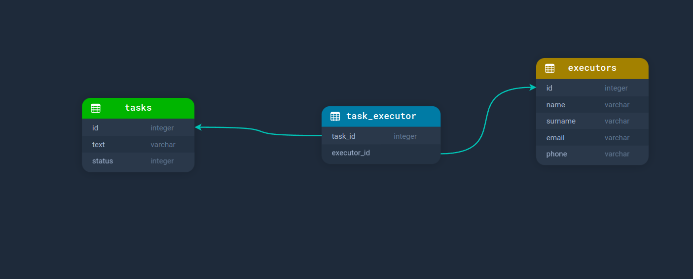

## О проекте
архитектура бд

## Как поднять? 
### Скопируйте переменные окружения
```bash 
cp .env.example .env
```
### Запустите контейнеры
```bash 
docker-composer up -d
```
### Установите зависимости composer
```bash 
docker-compose exec laravel.test composer install
```
### Сгенерируйте ключ
```bash 
php artisan key:generate
```
### Запустите миграции
```bash 
docker-compose exec laravel.test php artisan migrate
```
#### При запуске проекта могут возникнуть проблемы с правами на папку storage.
#### Необходимо будет выдать права на эту папку с помощью команды chmod
